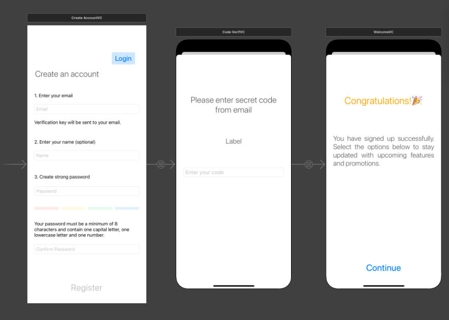
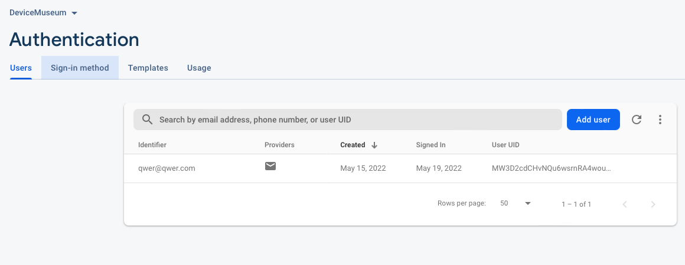
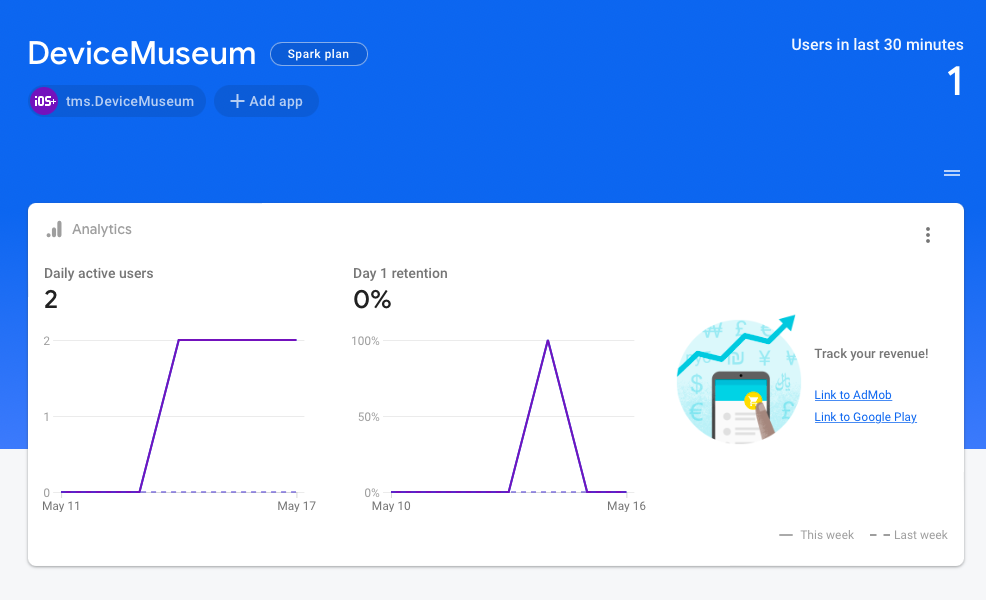
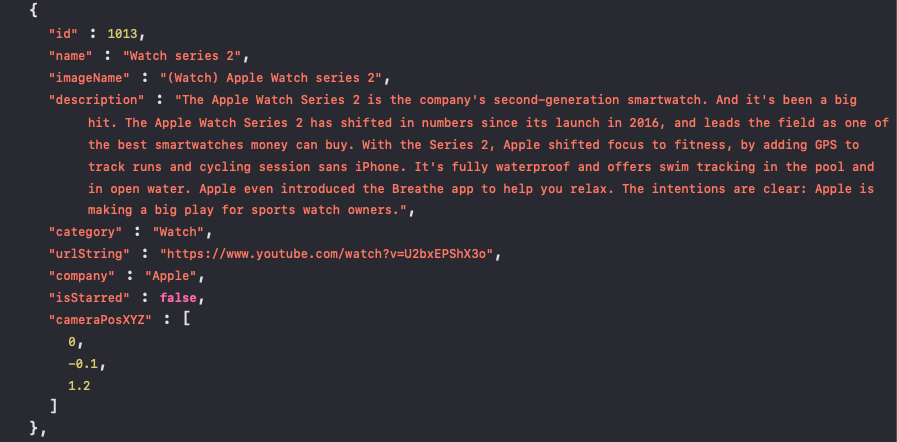

# Device Museum

## Objective

An application has been developed with which you can view collections of 
various devices, see realistic 3D images, read a description, and watch 
a video presentation.

## Summary

The application is built on the Model-View-Controller (MVC) architecture and 
includes view controllers: data entry page, registration page. The data to 
display is pulled from a JSON file. The menu is built on SwiftUI View 
elements, including such frameworks as ARKit, QuickLook, WebKit, MapKit. 
User registration used Sign-in providers (Email/Password) occurs through FireBase.

## Login

Users must register and log in before they can proceed to the main part of the app. 
When you restart the app, the main menu is immediately displayed.

## Main View: List

The main menu consists of 4 categories of devices: Iphone, IPad, Watch, Other.
Clicking on an element opens a detailed view of the device with a rotated 3D image
and a detailed description. By clicking on the button, you can go to the YouTube 
page to watch the video presentation of the device.

## NavigationStack

* An alternative SwiftUI NavigationView implementing classic stack-based navigation giving also some more control on animations and programmatic navigation.

Download `NavigationStack`
link [here](https://github.com/matteopuc/swiftui-navigation-stack)

## Map View

* Using the MapKit framework, you can see the location of the museum on the map.

### ARKit & QuickLook frameworks  

USDz is is a 3D file format that shows up as AR content created by Pixar.
Using AR Quick Look is as simple as providing it with the path to your USDZ
or Reality content and letting it do its magic. And there are lots of nifty
things you can do with it, too.

## Backend

### Authentication

Download `Firebase`
link [here](https://github.com/firebase/firebase-ios-sdk)

* Use Email/Password FireBase authentication to you can register and log users in.

* Analyze app usage statistics and data.

### JSON Info

* An example of a part of a JSON file with data to display in the application menu.

